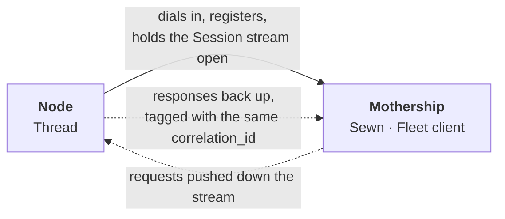
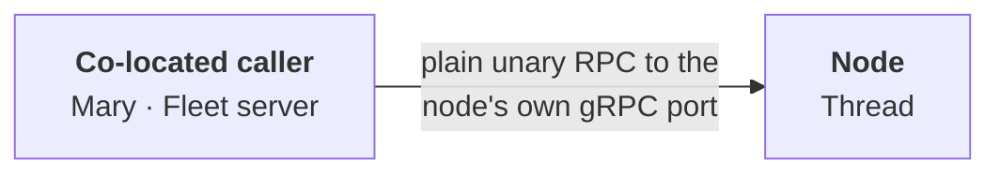
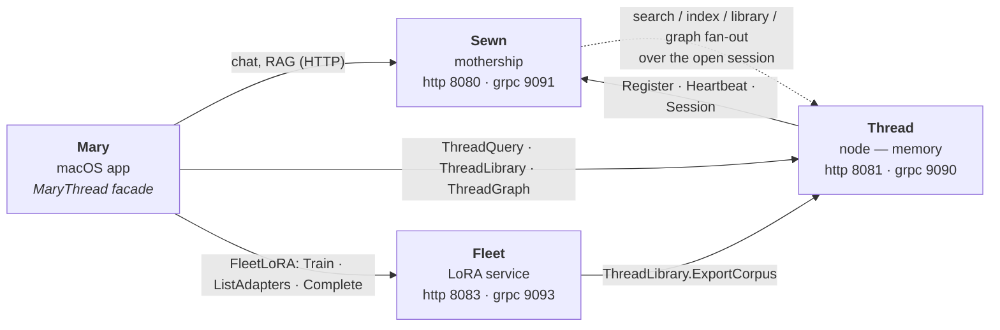
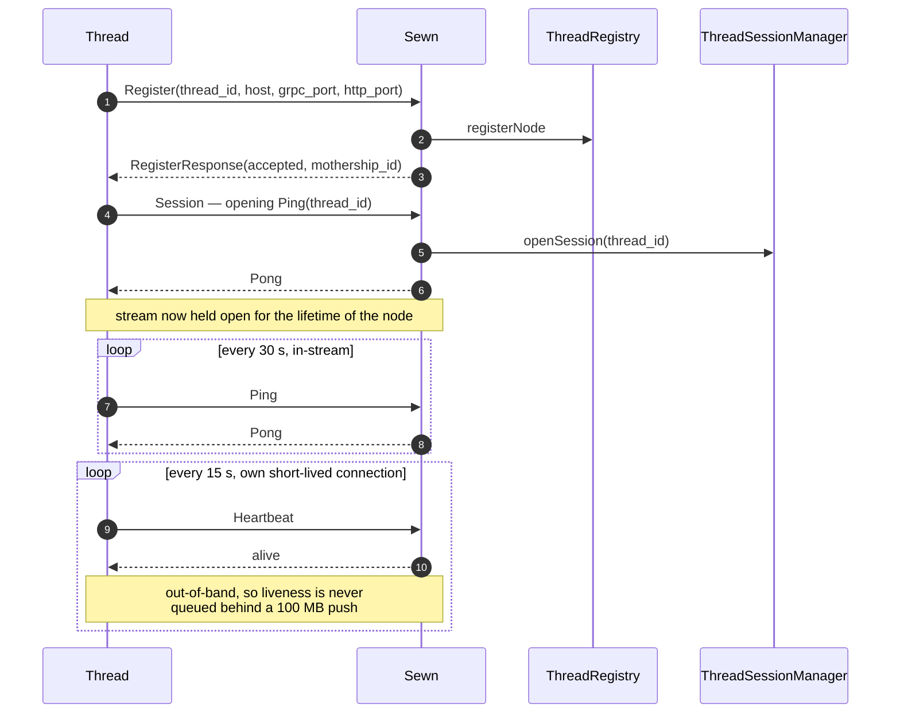
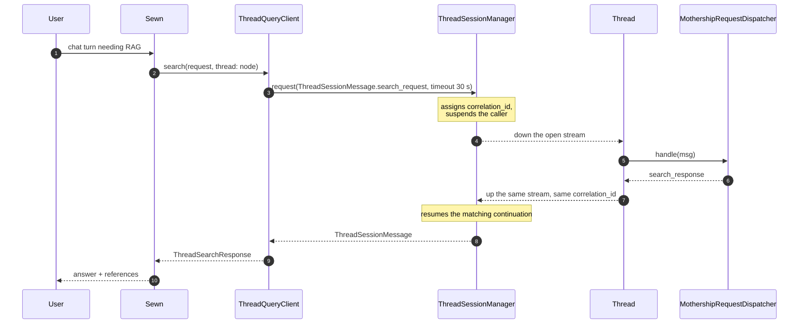
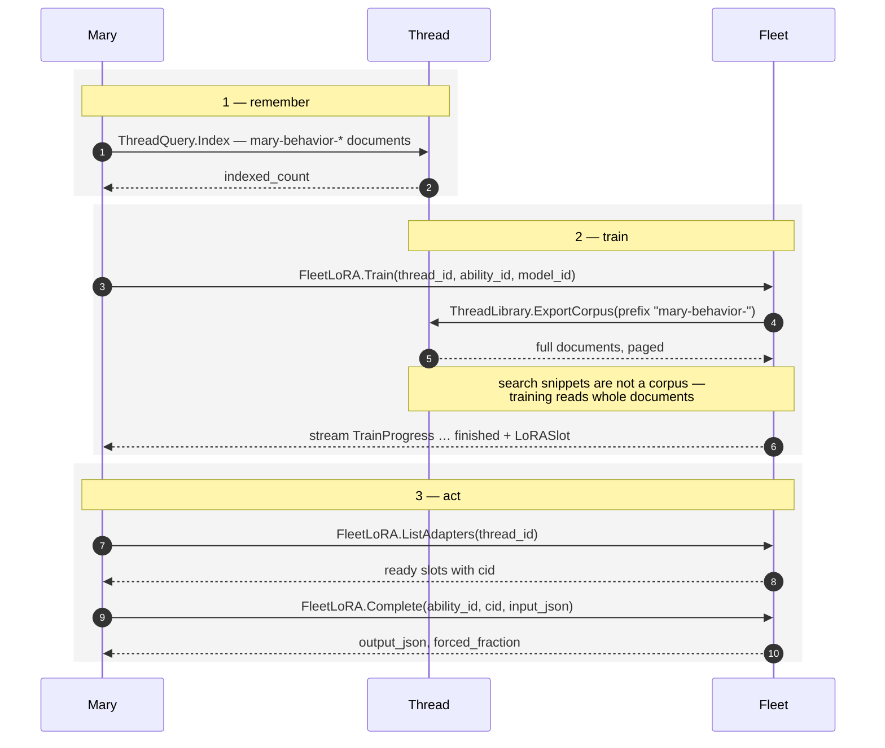
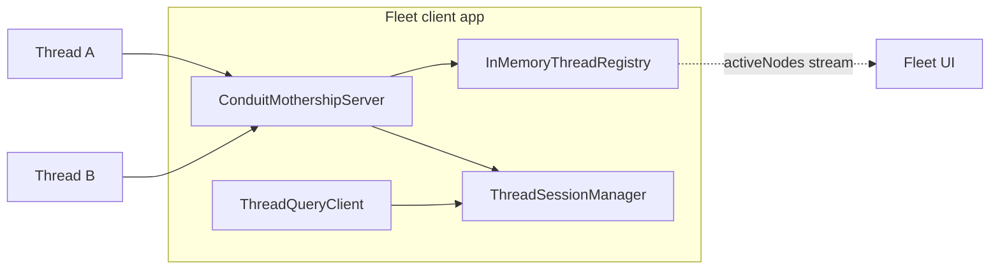

# Conduit

Conduit is the wire between a **mothership** and its **nodes**.

It is a Swift package holding one canonical set of `.proto` files, the types
generated from them, and the session/client/server machinery that every service
on the network links against — so each side speaks the exact same wire format
from the exact same source. Change the contract in one place, regenerate, and
every consumer compiles against the new shape or fails loudly.

The problem it exists to solve is reachability. A node — a laptop, a Pi, a box
behind a NAT — is not addressable from the outside, so the mothership can never
dial it. Conduit inverts the direction: **the node dials in and holds the
connection open**, and the mothership pushes work *down* that already-open
stream. The TCP connection flows node → mothership; the request/response logic
flows mothership → node.

Conduit is a library only; it ships no executable. Each service adds it as a
SwiftPM dependency and implements the seams (protocols) it defines.

| | |
| --- | --- |
| **`Protos/thread.proto`** | `thread.v1` — registration, the bidirectional session envelope, and the search / index / library / graph surface. |
| **`Protos/fleet.proto`** | `fleet.v1` — `FleetLoRA`, the adapter-training and gated-completion service. |
| **Generated stubs** | `Thread_V1_*` / `Fleet_V1_*` messages plus grpc-swift clients and server protocols. |
| **Session machinery** | Correlation engine, reverse-dial client, reusable mothership server, node registry. |
| **Seams** | `ThreadRegistry`, `SessionRequestHandling`, `ConduitLogger` — implemented by consumers. |

---

## The two call paths

Conduit carries traffic two ways, and which one you get depends on whether the
caller can reach the node directly.

**The session path — the node is not reachable.** The node dials in, registers,
opens the bidirectional `Session` stream and keeps it alive. Every request and
response message is also a `oneof` arm of `ThreadSessionMessage`, so the
mothership wraps a request in that envelope, stamps it with a `correlation_id`,
and writes it down the stream. The node dispatches it locally and writes the
correlated response back up. One stream carries many in-flight requests at
once — that is what the correlation id buys.



**The direct path — the caller sits next to the node.** The node *also* hosts
`ThreadQuery`, `ThreadLibrary` and `ThreadGraph` as ordinary unary services on
its own gRPC port. A caller on the same machine skips the mothership entirely
and calls them as normal RPCs against the generated stubs. Same proto, same
types, no envelope, no correlation.



---

## MaryOS — a worked example

**MaryOS** is the whole stack running on one Mac: **Mary**, an ambient macOS
assistant, backed by three servers she launches and supervises herself. Every
arrow below is Conduit except one — Mary's own chat and RAG traffic into Sewn,
which is plain HTTP.



State lives under `~/Documents/maryOS` — `sewn-db/`, `thread-db/`, `fleet-db/`,
one directory per server.

Each one takes a different piece of Conduit:

| Service | Role | What it takes from Conduit |
| --- | --- | --- |
| **Sewn** | mothership — auth, chat, RAG, royalties | `ThreadRegistrationServiceImpl`, `ThreadSessionManager`, `ThreadQueryClient`; implements `ThreadRegistry`. Predates `ConduitMothershipServer` and still runs its own NIO bootstrap |
| **Thread** | node — vectors, documents, knowledge graph | `MothershipRegistrationClient`; implements `SessionRequestHandling`; hosts the generated `ThreadQuery`/`Library`/`Graph` servers |
| **Fleet** | LoRA training + schema-gated completion | hosts generated `FleetLoRA`; dials Thread's `ThreadLibrary`; its desktop client runs `ConduitMothershipServer` + `InMemoryThreadRegistry` so Threads can dial *it* |
| **Mary** | the app | generated `Thread_V1_*` / `Fleet_V1_*` stubs, wrapped by her own `MaryThread` target |

### A Thread joins the network

`MothershipRegistrationClient` runs this loop and reconnects on its own — the
only thing Thread writes is the dispatcher.



A node counts as active while `lastSeen` is under 60 s. Two liveness channels
exist because one is not enough: a large inbound push can saturate the session
stream and stall the in-stream ping behind it, so the unary heartbeat rides its
own connection and keeps the node from being evicted mid-transfer. In the other
direction, a 45 s watchdog on the Thread side tears the session down if nothing
arrives at all, and the loop reconnects after a 5 s backoff.

### Sewn fans a search out over the session



Per-RPC timeouts are deliberate: interactive reads get 30 s, library pages 90 s,
index 120 s. A wedged node otherwise stalls every fan-out — every chat turn —
behind the blanket timeout before degrading.

### The Life loop — Mary learns a skill

Mary's behavioral memory is written to Thread, trained into a LoRA by Fleet,
and read back as a schema-gated completion. This is the direct path end to end:
three processes on one machine, all speaking Conduit's generated types.



### Fleet as a second mothership

`ConduitMothershipServer` and `InMemoryThreadRegistry` exist because Sewn is not
the only destination a Thread can dial. Fleet's desktop client assembles the same
four pieces — registry, session manager, server, query client — and accepts
Thread connections itself, without re-writing the NIO bootstrap:



---

## The protos

### `Protos/thread.proto` — `package thread.v1`

Services are grouped by **who hosts them**, and a service being declared here is
not the same as it being served over the wire — which of the two call paths
reaches it matters:

| Service | Hosted by | Methods | Reachable by |
| --- | --- | --- | --- |
| `ThreadRegistration` | Mothership | `Register`, `Heartbeat`, `UpdateAvailability`, `Session` | direct — it *is* the way in |
| `ThreadQuery` | Thread | `Search`, `Index`, `Remove` | both paths |
| `ThreadLibrary` | Thread | `Library`, `Documents`, `ExportCorpus` | both — except `ExportCorpus`, which has no envelope arm and is direct only |
| `ThreadGraph` | Thread | `Query` — entities, relationships, one-hop expansion | both paths |
| `ThreadUpdate` | Thread, nominally | `UpdateGroup`, `UpdateDocument`, `Stats` | **session only** — declared for type generation, but Thread's direct server does not bind it |

`ThreadSessionMessage` is the envelope the `Session` stream carries:

- `correlation_id` — pairs a response with its request.
- `thread_id` — set by the Thread on every ping so the mothership can identify
  the stream.
- `payload` — a `oneof` over `ThreadSessionPing`/`Pong` plus every request and
  response type.

**When you add a new request/response pair, add it both as its own message *and*
as a new `oneof` arm in `ThreadSessionMessage`** — otherwise it works on the
direct path and silently cannot be fanned out. Fields 13–22 are `reserved`: they
were the `ThreadHNSW` arms, retired with the HNSW engine.

### `Protos/fleet.proto` — `package fleet.v1`

`FleetLoRA` is hosted by Fleet and dialled directly — it has no session envelope
and no fan-out. Named LoRA slots, one per `thread_id` × `ability_id`:
`ListAdapters`, `AdapterStatus`, `Train` (server-streaming `TrainProgress`), and
`Complete` for one gated completion through a ready slot. Training
content-addresses its input set; the slot path is the user-facing identity and
overwrites in place.

---

## Generated code — `Sources/Conduit/Generated/`

Generated by `protoc`; **do not edit by hand**.

- `thread.pb.swift` / `fleet.pb.swift` — SwiftProtobuf message types.
- `thread.grpc.swift` / `fleet.grpc.swift` — grpc-swift client stubs and server
  protocols.

Regenerate with [`scripts/generate.sh`](scripts/generate.sh) after editing a
proto. The script builds `protoc-gen-grpc-swift` from the package's resolved
`grpc-swift-protobuf` checkout — so the generated code always matches the runtime
the package links against, rather than whatever version Homebrew happens to have —
and emits every file with `Visibility=Public`. Requires `protoc` and
`protoc-gen-swift` on `PATH` (`brew install protobuf swift-protobuf`) and a prior
`swift package resolve`.

---

## Infrastructure — `Sources/Conduit/`

Everything below is hand-written and wraps the generated stubs into something
each side can drop in.

### Client (`Client/`)

- **`MothershipRegistrationClient`** — *used by the node.* Owns the connection to
  the mothership. Registers with `waitForReady` so a node started before its
  mothership connects the moment it comes up, opens the `Session` stream, keeps
  it alive with 30 s in-stream pings and a 15 s out-of-band unary heartbeat, runs
  a 45 s staleness watchdog, and reconnects with backoff on drop. Incoming
  requests go to a `SessionRequestHandling` dispatcher and the returned response
  is written back up the stream. Also exposes `sendAvailabilityUpdate`.
- **`ThreadQueryClient`** — *used by the mothership.* The typed, caller-facing API
  for fan-out (`search`, `index`, `remove`, `library`, `documents`, `graph`,
  `updateGroup`, `updateDocument`, `stats`). Each method wraps its request in a
  `ThreadSessionMessage`, sends it through `ThreadSessionManager` to a specific
  `ThreadNode`, and unwraps the correlated response under a per-RPC timeout.

### Server (`Server/`)

- **`ConduitMothershipServer`** — *used by any destination.* Binds the
  `ThreadRegistration` service so a consumer can accept node connections without
  re-writing the NIO bootstrap. Carries the HTTP/2 tuning the large payloads need:
  100 MB message cap, 16 MB window, 1 MB frames, gzip, and keepalive settings that
  admit the client's own.
- **`ThreadRegistrationServiceImpl`** — implements the service. Handles
  `register`/`heartbeat`/`updateAvailability` against a `ThreadRegistry`, and runs
  the `session` handler: reads the node's opening ping, opens a managed channel in
  the `ThreadSessionManager`, then runs concurrent reader/writer tasks for the
  lifetime of the stream.
- **`InMemoryThreadRegistry`** — a `ThreadRegistry` for destinations that do not
  persist node state. Tracks connected nodes and broadcasts the active list on
  every change, so a UI can subscribe with `changes()`.

### Session (`Session/`)

- **`ThreadSessionManager`** — the correlation engine. Holds one outgoing channel
  per connected node and a map of in-flight `correlation_id → continuation`.
  `request(_:to:)` enqueues a message and suspends until the matching response
  arrives or a timeout fires; `deliver(_:)` resumes the right continuation;
  `closeSession` cancels everything pending for a dropped node. It deliberately
  stores an `AsyncStream.Continuation` rather than the raw gRPC writer, so a write
  can never escape the stream's lifetime.
- `ThreadSessionError` — `noSession`, `unexpectedPayload`, `timeout`.

### Node (`Node/`)

- **`ThreadNode`** — value type describing a registered node (id, host, ports,
  `lastSeen`, `acceptingStorage`, `isActive`). Motherships key their registry and
  fan-out on these.

### Protocols (`Protocols/`) — the seams consumers implement

- **`ThreadRegistry`** — *implemented by the mothership.* Where
  `ThreadRegistrationServiceImpl` writes registration, heartbeat, and availability
  updates.
- **`SessionRequestHandling`** — *implemented by the node.* The dispatcher
  `MothershipRegistrationClient` calls for each request pushed down the stream;
  returns the response message, or `nil` if unsupported.
- **`ConduitLogger`** — *implemented by both.* Logging seam so consumers route
  Conduit's events through their own stack. `SwiftLogConduitLogger` is a default
  adapter over swift-log.

### Support (`Support/`)

- **`payloadName(_:)`** — human-readable name for a session payload, used in logs
  on both sides.

---

## Adding Conduit as a dependency

```swift
// Package.swift
.package(url: "<conduit-repo-url>", from: "<version>"),
// or, for a sibling checkout:
.package(path: "../Conduit"),
// …
.target(name: "Sewn",   dependencies: [.product(name: "Conduit", package: "Conduit")]),
.target(name: "Thread", dependencies: [.product(name: "Conduit", package: "Conduit")]),
```

Conduit requires Swift 6.0 and macOS 15+, and links grpc-swift 2.x, the NIO
HTTP/2 transport, grpc-swift-protobuf, swift-protobuf, and swift-log (see
[`Package.swift`](Package.swift)).
